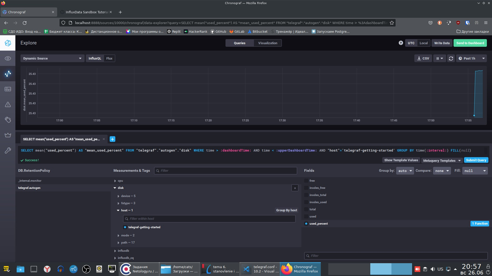
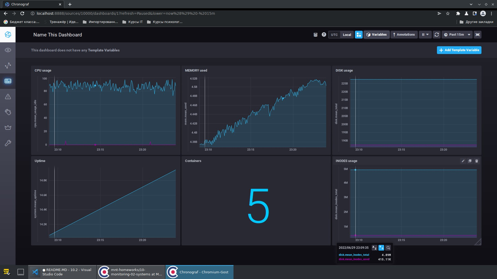

# Домашнее задание к занятию "10.02. Системы мониторинга"

### Задание 1
```
Опишите основные плюсы и минусы pull и push систем мониторинга.
```
Ответ:
- pull
```
Плюсы:
- Уверенность в том, что данные поступили откуда было надо и те, какие нам нужны, 
поскольку инициирует сбор метрик сам сервер, соединения устанавливаются и сразу 
закрываются. Узлы, с которых будем брать метрики, известны заранее;
- Можно шифровать траффик, используя сертификаты;

Минусы:
- Могут потеряться метрики в случае нестабильного соединения с хостом;
- В случем с необходимости собирать метрики с постоянно меняющихся хостов (например,
сегодня одни контейнеры отслеживаем, завтра другие), то придется ручками добавлять эти
хосты в мониторинг.
```

- push
```
Плюсы:
- Можно заставить агенты отправлять метрики на несколько разных серверов, если то будет
надо;
- В случае нестабильного соединения с сервером, агент может накапливать метрики, а 
потом их все отдать. Так они не потеряются;
- Если надо отслеживать часто меняющиеся хосты (виртуалки, контейнеры), то можно в их 
состав сразу включать агента системы мониторинга, что автоматизирует их включение в 
мониторинг.

Минусы:
- Порт, через который должны поступать метрики, всегда прослушивается, мало ли по 
ошибке чьи данные прилетят;
- На каждом узле надо настраивать агент для отправки метрик, это может быть 
трудозатратно. Впрочем, на эти задачи есть автоматизция разная;
```

---

### Задание 2
```
Какие из ниже перечисленных систем относятся к push модели, а какие к pull? А может 
есть гибридные?

Prometheus
TICK
Zabbix
VictoriaMetrics
Nagios
```
Ответ:
Prometheus - pull, но для случаев, когда надо собирать метрики с хоста или не 
работающего постоянно, или с непостоянной связью с ним, можно настроить pushgateway, 
куда этот хост будет пушить свои метрики когда может, а Prometheus их потом оттуда 
заберёт. 
TICK - push. Там telegraph собирает данные и отдаёт их.
Zabbix - гибридная;
VictoriaMetrics - гибридная. Почитал про неё статью одного дядьки из Leroy Merlin, он 
пишет, что по потреблению ресурсов она лучше, чем Prometheus;
Nagios - Гибридная. Вообще-то pull, но есть плагин nsca для отправки метрик на сервер.

---

### Задание 3
```
Склонируйте себе репозиторий и запустите TICK-стэк, используя технологии docker и 
docker-compose.

В виде решения на это упражнение приведите выводы команд с вашего компьютера 
(виртуальной машины):

- curl http://localhost:8086/ping
- curl http://localhost:8888
- curl http://localhost:9092/kapacitor/v1/ping
А также скриншот веб-интерфейса ПО chronograf (http://localhost:8888).
```
Ответ:

1.

```
[cats@host-63 sandbox-master]$ curl http://localhost:8086/ping -v
*   Trying 127.0.0.1:8086...
* Connected to localhost (127.0.0.1) port 8086 (#0)
> GET /ping HTTP/1.1
> Host: localhost:8086
> User-Agent: curl/7.81.0
> Accept: */*
> 
* Mark bundle as not supporting multiuse
< HTTP/1.1 204 No Content
< Content-Type: application/json
< Request-Id: 2d535c0c-f575-11ec-8028-0242ac160003
< X-Influxdb-Build: OSS
< X-Influxdb-Version: 1.8.10
< X-Request-Id: 2d535c0c-f575-11ec-8028-0242ac160003
< Date: Sun, 26 Jun 2022 17:26:56 GMT
< 
* Connection #0 to host localhost left intact
```

2.
```
box-master]$ curl http://localhost:8888 -v
*   Trying 127.0.0.1:8888...
* Connected to localhost (127.0.0.1) port 8888 (#0)
> GET / HTTP/1.1
> Host: localhost:8888
> User-Agent: curl/7.81.0
> Accept: */*
> 
* Mark bundle as not supporting multiuse
< HTTP/1.1 200 OK
< Accept-Ranges: bytes
< Cache-Control: public, max-age=3600
< Content-Length: 336
< Content-Security-Policy: script-src 'self'; object-src 'self'
< Content-Type: text/html; charset=utf-8
< Etag: "3362220244"
< Last-Modified: Tue, 22 Mar 2022 20:02:44 GMT
< Vary: Accept-Encoding
< X-Chronograf-Version: 1.9.4
< X-Content-Type-Options: nosniff
< X-Frame-Options: SAMEORIGIN
< X-Xss-Protection: 1; mode=block
< Date: Sun, 26 Jun 2022 17:29:51 GMT
< 
* Connection #0 to host localhost left intact
<!DOCTYPE html><html><head><meta http-equiv="Content-type" content="text/html; charset=utf-8"><title>Chronograf</title><link rel="icon shortcut" href="/favicon.fa749080.ico"><link rel="stylesheet" href="/src.9cea3e4e.css"></head><body> <div id="react-root" data-basepath=""></div> <script src="/src.a969287c.js"></script> </body></html>
```

3.
```
[cats@host-63 sandbox-master]$ curl http://localhost:9092/kapacitor/v1/ping -v
*   Trying 127.0.0.1:9092...
* Connected to localhost (127.0.0.1) port 9092 (#0)
> GET /kapacitor/v1/ping HTTP/1.1
> Host: localhost:9092
> User-Agent: curl/7.81.0
> Accept: */*
> 
* Mark bundle as not supporting multiuse
< HTTP/1.1 204 No Content
< Content-Type: application/json; charset=utf-8
< Request-Id: b5d1d6a2-f575-11ec-8055-000000000000
< X-Kapacitor-Version: 1.6.4
< Date: Sun, 26 Jun 2022 17:30:45 GMT
< 
* Connection #0 to host localhost left intact
```
4. 


---

### Задание 4
```
Перейдите в веб-интерфейс Chronograf (http://localhost:8888) и откройте вкладку Data explorer.

Нажмите на кнопку Add a query
Изучите вывод интерфейса и выберите БД telegraf.autogen
В measurments выберите mem->host->telegraf_container_id , а в fields выберите used_percent. Внизу 
появится график утилизации оперативной памяти в контейнере telegraf.
Вверху вы можете увидеть запрос, аналогичный SQL-синтаксису. Поэкспериментируйте с запросом,
попробуйте изменить группировку и интервал наблюдений.
Для выполнения задания приведите скриншот с отображением метрик утилизации места на диске 
(disk->host->telegraf_container_id) из веб-интерфейса.
```
Ответ:


---

### Задание 5

```
Изучите список telegraf inputs. Добавьте в конфигурацию telegraf следующий плагин - docker:
[[inputs.docker]]
  endpoint = "unix:///var/run/docker.sock"
Дополнительно вам может потребоваться донастройка контейнера telegraf в docker-compose.yml 
дополнительного volume и режима privileged:

  telegraf:
    image: telegraf:1.4.0
    privileged: true
    volumes:
      - ./etc/telegraf.conf:/etc/telegraf/telegraf.conf:Z
      - /var/run/docker.sock:/var/run/docker.sock:Z
    links:
      - influxdb
    ports:
      - "8092:8092/udp"
      - "8094:8094"
      - "8125:8125/udp"
После настройке перезапустите telegraf, обновите веб интерфейс и приведите скриншотом список
measurments в веб-интерфейсе базы telegraf.autogen . Там должны появиться метрики,
связанные с docker.
```

Ответ:


---

### Дополнительное задание (со звездочкой*) - необязательно к выполнению

```
В веб-интерфейсе откройте вкладку Dashboards. Попробуйте создать свой dashboard с отображением:

- утилизации ЦПУ
- количества использованного RAM
- утилизации пространства на дисках
- количество поднятых контейнеров
- аптайм
- ...
- фантазируйте)
```

Ответ:
Ответ:

